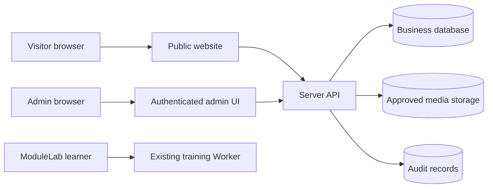
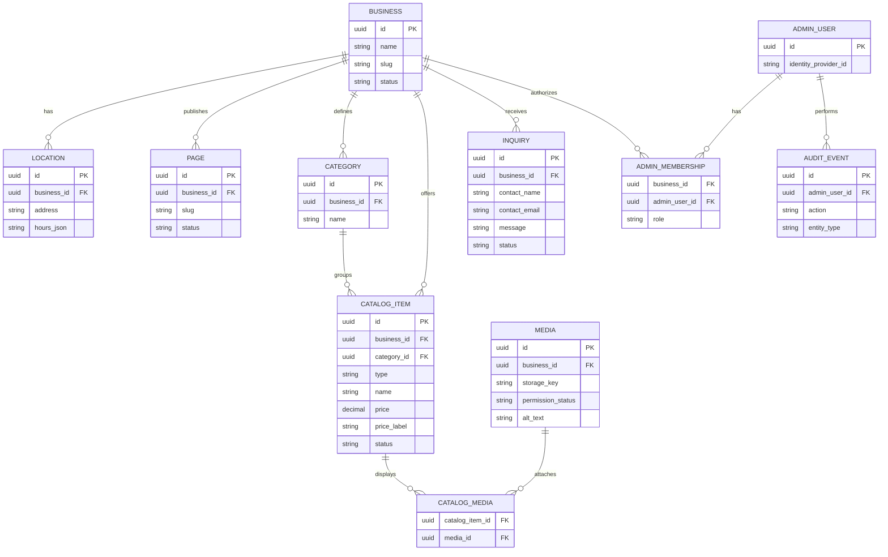

# Module 05 — Architecture proposal (not final)

## Deployment boundaries
- **Existing ModuleLab Worker:** currently serves training lessons and screenshots. Keep operational while designing the business application.
- **Public business site:** separate Cloudflare deployment/project or route to avoid breaking the training website.
- **Admin application:** authenticated UI backed by server-side authorization.
- **Data services:** relational database for content and inquiries; object storage for approved media.

## Candidate stack
| Layer | Candidate | Decision gate |
|---|---|---|
| Public UI | TypeScript + accessible component system; Next.js or Cloudflare-native React | Prove supported Cloudflare runtime and deployment adapter |
| Admin UI | Same TypeScript app, isolated /admin routes | Server-side authorization tests |
| API | Cloudflare Worker-compatible server endpoints | Auth, validation, rate limits, auditability |
| Database | Supabase Postgres or Cloudflare D1 | SQL capabilities, access control, backups, cost |
| Auth | Managed authentication provider | MFA, session protection, admin provisioning, RBAC |
| Media | Cloudflare R2 or supported object storage | Access control, transformation, retention |
| Hosting | Cloudflare Workers | Separate staging/production, rollback and observability |

Do **not** treat candidate technology versions as pinned. Record exact versions after a deployable proof-of-concept, along with license and compatibility evidence in docs/dependencies.

## Logical architecture

## Proposed entity model

**Note:** BUSINESS remains in the logical model for clean data ownership even if Release 1 uses one business per deployment. This does not authorize multi-tenant access. Enforce tenant/business scope in every data access path.

## Security and data rules
- Validate input on the server and restrict upload types/sizes.
- Enforce admin role and business ownership in server endpoints and database policy where supported.
- Public endpoints expose only published records and approved media.
- Never place privileged database credentials in browser code.
- Rate-limit inquiries, protect against spam and record consent appropriately.
- Log administrative changes without storing secret values.
- Define data retention, deletion and backup/restore before production.

## Next technical proof
Build a small isolated Cloudflare proof-of-concept that verifies chosen framework build, API route, database connectivity, protected admin route and asset delivery. Keep it off the existing production ModuleLab Worker until validated.
